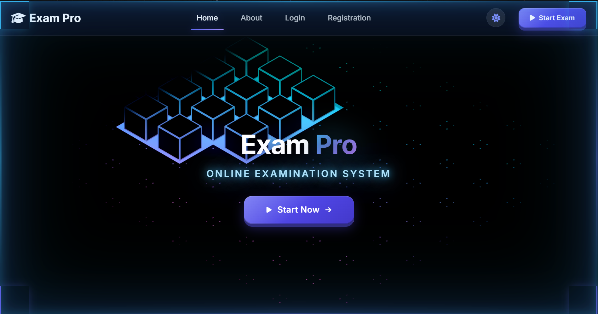
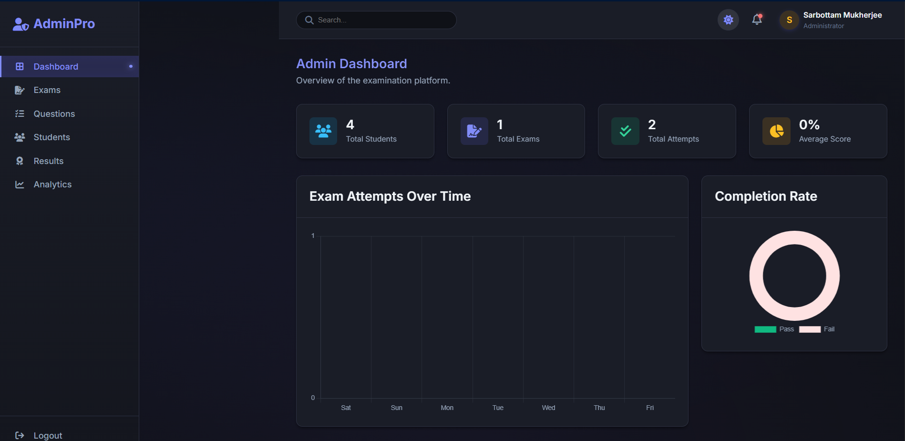
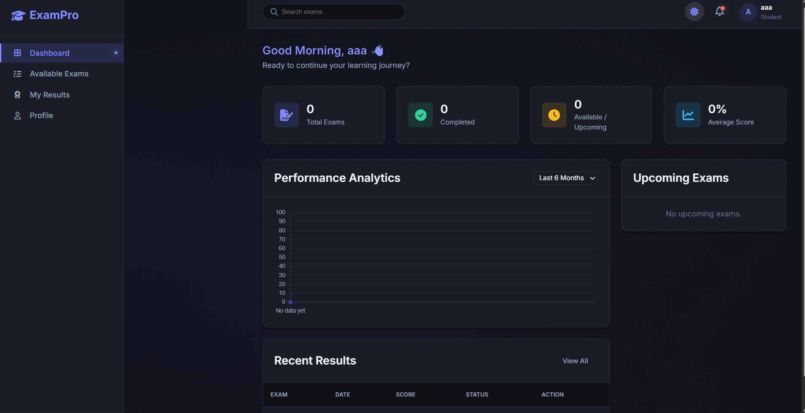

## 🌐 Live Demo

👉 **[Launch ExamPro](https://exampro-9398b.web.app/)**

# ExamPro 📝

### Online Examination System

ExamPro is a web-based online examination system designed to simplify and digitize the process of conducting and managing examinations.

## 🚀 Features

- 🔐 Student authentication
- 👨‍💼 Admin dashboard
- 📝 Online examinations
- ❓ Question management
- 📊 Exam results
- 👨‍🎓 Student dashboard
- 📈 Analytics
- 🔥 Firebase integration
- 🎨 Modern responsive interface
- 🌐 Firebase Hosting support
## 📸 Screenshots

### 🏠 Home Page


### 🔐 Login


### 📝 Registration


### 👨‍💼 Admin Dashboard


### 👨‍🎓 Student Dashboard


## 🛠️ Technologies Used

- HTML5
- CSS3
- JavaScript
- Firebase Authentication
- Cloud Firestore
- Firebase Hosting
- Three.js / 3D components

## 📂 Project Structure

```text
ExamPro/
├── admin/
├── student/
├── css/
├── js/
│   ├── admin/
│   ├── data/
│   ├── services/
│   ├── student/
│   └── 3d/
├── index.html
├── login.html
├── register.html
├── firebase.json
├── firestore.rules
└── 404.html
